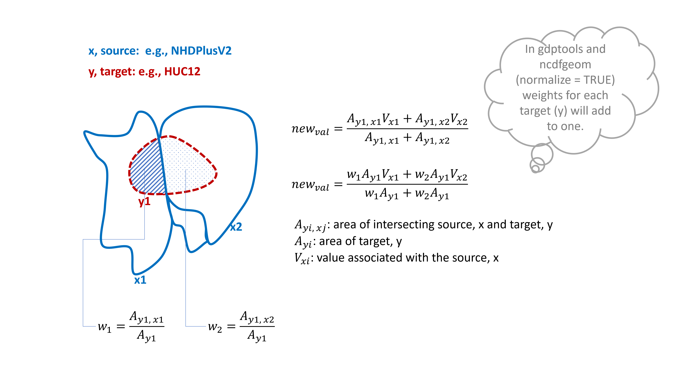
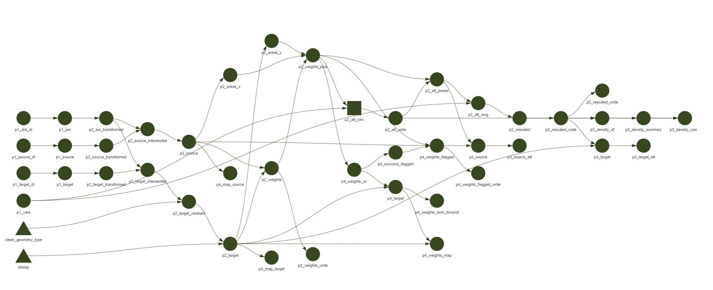
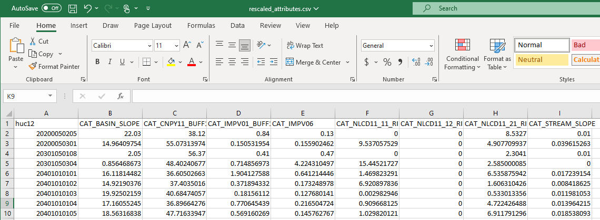
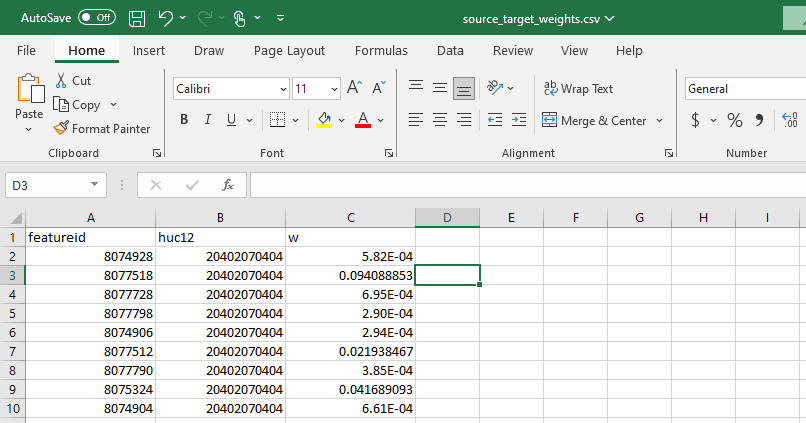
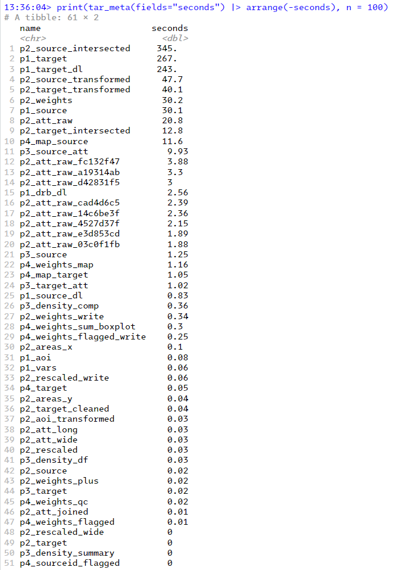
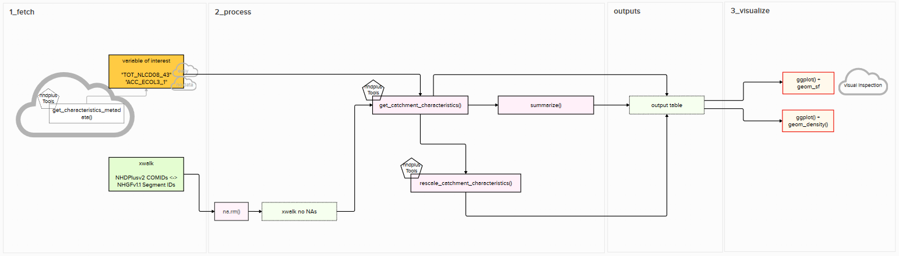

# Rescaling Attributes (Template Pipeline)


This repo contains a template {targets} pipeline for rescaling attributes to your intended spatial polygons. 

## Motivation 
In WMA, our models and projects work with their own special geospatial boundaries. Often, we find ourselves wanting to use the data processed to a certain polygon, but first, we need that data tied to our polygons. The hard way of doing that is to recreate the initial study, and use our polygons to aggregate data. But an easier way, to get a close estimate of the values we need, is to find the amount of overlap between the two polygons, and rescale those attributes with a simple weighted mean or other aggregation methods that make sense for the data in question.​

This kind of rescaling has happened a few times that I have tried to document them in the table below: 
| Project      | Source Attributes     | Source Polygons | Target Polygons                | Contact              | Data Release |
| :----------- | :-------------------- | :-------------- | :----------------------------- | :------------------- | :----------- |
| HyTest       | NHM-PRMS              | NHGF V1.0-1.2   | WBD 10-2020 HUC 12 (mainstems) | Sydney Fox           | ?            |
| Natl. IWAAs  | Water Use             | WBD ??? HUC12s  | WBD 10-2020 HUC 12 (mainstems) | Anthony Martinez     | In Progress  |
| PUMP         | Geospatial Attributes | NHDPlus V2.1    | NHGF V1.1                      | Lauren Koenig-Snyder | In Progress  |
| NHGF         | Geospatial Attributes | NHDPlus V2.1    | WBD 10-2020 HUC 12 (mainstems) | Ellie White          | In Progress  |
| RIMBE-WM     | Geospatial Attributes | NHDPlus V2.1    | WBD 10-2020 HUC 12 (mainstems) | Ellie White          | In Progress  |
| RIMBE-SED    | SEDAC                 | County          | WBD 10-2020 HUC 12 (mainstems) | Ellie White          | In Progress  |

Realizing this is a perpetual problem, and attempting to reduce duplicated workflows, we have made a template pipeline that can take in any source and/or target polygon. 

## Process
The pipeline takes in a set of variables of interest (a subset of the "CAT_[attribute]" in `nhdplusTools::get_characteristics_metadata()`). As of Feb. 2024, the pipeline has only been stress-tested with ~1,254 variables of interest as opposed to the full 14,139 available in the dataset. 

The source and target polygons in the template are the NHDPlusV2 (CONUS plus crude transboundary catchments) and WBD 10-2020 HUC12s (CONUS). The Area of Interest (AOI) is defined as the delaware river basin. We defined this AOI, as opposed to using the national polygons, so as to reduce the computational burden. But the same logic can be applied to national analysis. 

In phase 2, weights are built using `ncdfgeom::calculate_area_intersection_weights()`. The attributes are pulled with `nhdplusTools::get_catchment_characteristics()` and rescaled with basic dplyr functions such as `mutate()`, `group_by()`, and `summarize()`. The formulas below show what we are doing in the process phase. 



Phase 3 contains a density plots and choropleth maps built for a one variable of interest to ensure the pipeline is running as intended. Phase 4 contains one map emphasizing areas where the weights should add to one. Caution should be taken in areas where they do not. In addition, we output a flagged version of the weights table where target polygons are flagged if their weights did not add to one. 



## Outputs
The pipeline produces two main outputs: a weights table and a rescaled attributes table both in `.csv` format under `2_process/out/`.

**Attributes**



**Weights**



## How to run the pipeline
### Package management with [renv](https://rstudio.github.io/renv)
This project uses [renv](https://rstudio.github.io/renv) to manage packages used by the pipeline. Renv works behind the scenes to ensure that the same package versions used by the pipeline are used across contributors. It installs specific versions of packages to a `renv/` folder within the project directory that it loads when `library()` is invoked, even if the packages are installed elsewhere (e.g., in the `.libPaths()` path). When opening the project, renv should, behind the scenes, initiate itself and prompt the user for any additional actions needed. If this is the first time using renv on the project, it may take R a little while to set up as specific package versions are downloaded and installed. See [Collaboration in renv](https://rstudio.github.io/renv/articles/renv.html#collaboration) for more information.

If this is your first time using renv, install it from CRAN. Then try loading the targets library. If you get an error message saying "there is no package called ‘targets’", run `renv::install("targets")` and follow the prompts. You may need to do the same thing for `tarchetypes`. Now, you are ready to run `tar_make()`. This will install a lot of packages and may take a while.   

### Run the pipeline
This project uses [targets](https://books.ropensci.org/targets/) to run the pipeline. We assume you have some basic familiarity with it and proficiency in R. If you need help setting up or working through errors, please, contact Ellie White (ewhite@usgs.gov). Follow these steps to run the pipeline with the example data, which the pipeline will fetch for you, and the example attributes, which it will pull from the `nhdplusTools` package: 

1) Open the `rescaling-attributes-template.Rproj` file in rstudio.
2) Open the `_targets.R` file. 
3) Load in the targets library in the console with: `library(targets)`.
4) Run `tar_make()` in the console. 
5) If you see "End Pipeline [x minutes]" in the console, you have ran the pipeline successfully. Go to `2_process/out` to retrieve the results. 

### Your specific use case
Now, you can modify the pipeline's fetch targets in `1_fetch_targets.R` by substituting the targets with your source, target, area of interest geometry, and attribute data and run `tar_make()` again. Because we are usinng renv, you will need to install additional packages you need with `renv::install()` and update the renv lockfile (similar to an environment.yaml in Python) with `renv::snapshot()`. If you want to modify the pipeline for national analysis (instead of a regional area of interest), you will need to simply substitute `p2_source_intersected` and `p2_target_intersected` with `p2_source` and `p2_target` respectively. 

## Profiling
The most expensive target to build is intersecting the source polygons with the area of interest taking ~6 min. 



## Built With
* [R](https://www.r-project.org/about.html)

### SessionInfo()
```
R version 4.3.0 (2023-04-21 ucrt)
Platform: x86_64-w64-mingw32/x64 (64-bit)
Running under: Windows 10 x64 (build 19045)

Matrix products: default


locale:
[1] LC_COLLATE=English_United States.utf8  LC_CTYPE=English_United States.utf8    LC_MONETARY=English_United States.utf8
[4] LC_NUMERIC=C                           LC_TIME=English_United States.utf8    

time zone: America/Chicago
tzcode source: internal

attached base packages:
[1] stats     graphics  grDevices utils     datasets  methods   base     

other attached packages:
 [1] lubridate_1.9.2 forcats_1.0.0   stringr_1.5.1   dplyr_1.1.2     purrr_1.0.2     readr_2.1.4     tidyr_1.3.1    
 [8] tibble_3.2.1    ggplot2_3.4.2   tidyverse_2.0.0 targets_1.1.3  

loaded via a namespace (and not attached):
 [1] tidyselect_1.2.0   arrow_13.0.0.1     fastmap_1.1.1      digest_0.6.33      fst_0.9.8          base64url_1.4     
 [7] fstcore_0.9.14     timechange_0.2.0   mime_0.12          lifecycle_1.0.4    sf_1.0-13          ellipsis_0.3.2    
[13] processx_3.8.1     magrittr_2.0.3     compiler_4.3.0     rlang_1.1.1        tools_4.3.0        igraph_1.4.3      
[19] utf8_1.2.3         yaml_2.3.7         data.table_1.14.8  knitr_1.43         nhdplusTools_1.0.1 htmlwidgets_1.6.2 
[25] bit_4.0.5          classInt_0.4-9     curl_5.0.1         xml2_1.3.4         abind_1.4-5        KernSmooth_2.23-20
[31] withr_3.0.0        grid_4.3.0         fansi_1.0.4        e1071_1.7-13       colorspace_2.1-0   scales_1.2.1      
[37] cli_3.6.1          generics_0.1.3     rstudioapi_0.14    httr_1.4.7         tzdb_0.4.0         visNetwork_2.1.2  
[43] DBI_1.2.1          pbapply_1.7-0      ncdfgeom_1.2.0     proxy_0.4-27       maps_3.4.1         stars_0.6-4       
[49] assertthat_0.2.1   parallel_4.3.0     vctrs_0.6.5        jsonlite_1.8.5     callr_3.7.3        hms_1.1.3         
[55] bit64_4.0.5        units_0.8-2        glue_1.6.2         RNetCDF_2.7-1      codetools_0.2-19   ps_1.7.5          
[61] stringi_1.8.3      ncmeta_0.3.6       hydroloom_1.0.0    gtable_0.3.4       munsell_0.5.0      pillar_1.9.0      
[67] htmltools_0.5.5    R6_2.5.1           sbtools_1.3.0      backports_1.4.1    class_7.3-21       Rcpp_1.0.10       
[73] zip_2.3.0          xfun_0.39          pkgconfig_2.0.3   
```

## Planning 
Pipeline planning happend in [Mural](https://app.mural.co/t/gswocooeto6166/m/gswocooeto6166/1674664777393/0c9d8beacaa9c442e27bc5fe8112f05e6deaa68b?sender=uc2098797df19e98c2b2f4081). 


## Versioning
* v0.1.0 initial provisional release

## Authors
* **[Ellie White](https://www.usgs.gov/staff-profiles/elaheh-white)**  - *Lead Developer* - [USGS Water Mission Area](https://www.usgs.gov/mission-areas/water-resources)
* **[Lauren Koenig-Snyder](https://www.usgs.gov/staff-profiles/lauren-koenig)** - *Developer* -  [USGS Water Mission Area](https://www.usgs.gov/mission-areas/water-resources)

See also the list of [contributors](https://code.usgs.gov/wma/dsp/pipeline-templates/rescaling-attributes-template/-/network/main) who participated in this project.

## Contributing
We welcome contributions and suggestions from the community. Please consider 
reporting bugs or asking questions on the [issues page](https://code.usgs.gov/wma/wp/national-geospatial-attributes/-/issues). 
If you have contributions you would like considered for
incorporation into the project you can [fork this repository](https://docs.gitlab.com/ee/user/project/repository/forking_workflow.html#creating-a-fork)
and [submit a merge request](https://docs.gitlab.com/ee/user/project/merge_requests/) for review.

Go here for details on adhering by 
the [USGS Code of Scientific Conduct](https://www.usgs.gov/office-of-science-quality-and-integrity/fundamental-science-practices).

## License
This project is licensed under the Creative Commons CC0 1.0 Universal License - see the [LICENSE.md](LICENSE.md) file for details

## Suggested Citation
In the spirit of open source, please cite any re-use of the source code stored in this repository. Below is the suggested citation:
* White, E. & Koenig-Snyder, L. & Blodgett, D. & Wieczorek, M. (2024). Rescaling Attributes Template. https://code.usgs.gov/wma/dsp/pipeline-templates/rescaling-attributes-template. [workflow]

`This repository contains code produced for the Data Assembly function at the United States Geological Survey (USGS). As a work of the United States Government, this product is in the public domain within the United States.`

## Acknowledgments
* Thanks to David Blodgett for writing/modifying the main intersecting function used.
* Thanks to Michael Wieczorek for reviwing a major merge request and comparing this method to the one developed in Python. 
* Thanks to Anthony Martinez for helping with the security and domain review for the release. 